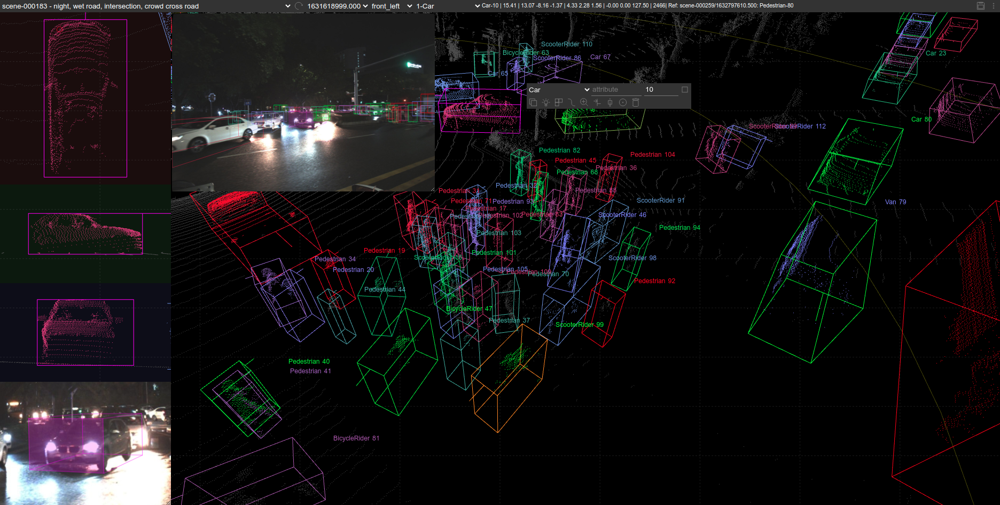

# Point Cloud 3D Bounding Box Annotation Tool




## Features

- 9 DoF box editing
- edit on perspective view and projective view
- camera image as context
- camera image and LiDAR point cloud fusion if extrinsic info is given
- focus target object in image if extrinsic info is given
- binary/ascii pcd files and all format image files
- multi-camera images
- auto image follow if extrinsic transformation information is given
- semi-auto box annotation (details later)
- objects/boxes color by category
- focus mode to hide background to check details easily
- stream play/stop
- auto object tracking id generation


## Requirements

python2, cherrypy


## Start
run the following script in shell, then go to http://127.0.0.1:8081
```
python main.py
```

## Data preparation

````
public
   +- data
       +- scene1
             +- image
                  +- 0000.jpg
                  +- 0001.jpg
             +- pcd
                  +- 0000.pcd
                  +- 0001.pcd
             +- label
                  +- 0000.json
             +- calib.txt
       +- scene2
             
````

label is the directory to save the annotation result.

calib.txt is the calibration matrix from point cloud to image. it's optional, but if provided, the box is projected on the image so as to assist the annotation.

## object type configuration

## Operations

```
mouse scroll up/down:  zoom in/out
mouse left key hold/move: rotate (change main view)
mouse right key hold/move: pan

left click on a box: select
left click on a selected box: show transform control
left click on non-box area: hide transform control if present, or unselect box

when transform control if present:
v: switch transform modes among resize/translate/rotate
z/x/c: turan on/off x/y/z axis
use mouse to adjust the box.


in side view (projective view):

a: move box left
s: move box down
d: move box right
w: move box up
q: rotate box left
e: rotate box right

double click on center: auto-shrink box by adjusting all borders to nearest innner point.
double click on border: auto-shrink box by adjusting the border to nearest innner point.
double click on corder: auto-shrink box by adjusting the corresponding borders to nearest innner point.

click and drag border/corner/center: move border/corner/box.

in main view (persptive view):

if one box is selected, the following key can be used to adjust it in main view:

q w e r t
a s d f g
z x c v b n m

q: move box right (+x)
a: move box left  (-x)
w: move box forward    (+y)
s: move box backward  (-y)
e: move box up    (+z)
d: move box down  (-z)
r: rotate right (z-axis)
f: rotate left (z-axis)
g: rotate the box heading direction by 180 degree
t: reset the box

Q (or q + right-click-and-hold): scale up in x axis
A (or a + right-click-and-hold): scale down in x axis
W (or w + right-click-and-hold): scale up in y axis
S (or s + right-click-and-hold): scale down in y axis
E (or e + right-click-and-hold): scale up in z axis
D (or d + right-click-and-hold): scale down in z axis

z toggle x axis of box transform control
x toggle y axis of box transform control
c toggle z axis of box transform control

v switch transform control view: tranform/rotate/scale

b switch box between bus/perdestrian/car
n create new box at the position of mouse

m/Ctrl + left_click  paste/auto-adjust a box from a ref-box


ctrl+s  save current frame
del/ctrl+d  remove selected box


1,2  select previous/next box
3,4  show previous/next frame in current scene
5,6,7  show camera helper box of sideviews.

```
