[工具介绍](./README.md)

[操作说明](./README_cn.md)

[快捷键](./doc/shortcuts_cn.md)

# 什么是3D目标检测/追踪

3D目标检测就是给定3D场景(激光点云,或者图像), 把所有感兴趣的物体识别出来, 用3D立方体将物体框起来, 并给出物体的类别. 如果还有追踪任务, 则需要给每个目标物体分配唯一ID.

对应的数据集可以参考
[KITTI数据集](http://www.cvlibs.net/datasets/kitti/eval_object.php?obj_benchmark=3d), 
[百度Apollo数据集](http://apolloscape.auto/tracking.html)

## 如何制作

通常我们需要专用的数据采集车, 采集各种场景的数据. 数据包括激光雷达点云, 相机图片等. 然后从中挑选有代表性的片段进行标注. 

# 标注要求

下文描述3D目标检测和追踪数据集(点云／图像)的标注．

## 标注范围

### 距离
不管目标物体距离多远, 只要是可辨认出目标物体的都应该标注．如果被完全遮挡则不用标．

### 类别及属性
所有可移动的物体都要标注.

部分类别有一些属性，需要根据实际情况选择或者填写
比如人的属性， 伞，婴儿车，行李，坐着，蹲着..
rider的属性： 伞，载客1个，载客2个..
车的属性： 门开着

目前支持的类别如下:

|Name|中文|可选属性|参考图片|
|----|----|------|------|
|Car|轿车|门开着||
|Van|面包车|||
|PoliceCar|警车|||
|Pedestrian|行人|伞,行李,坐着,蹲着,弯腰||
|RoadWorker|工人|||
|Child|小孩|||
|Cone|雪糕筒|||
|FireHydrant|消防栓|||
|ReflectiveTriangle|安全三角|||
|PlatformCart|平板车|||
|ConstructionCart|建筑小车||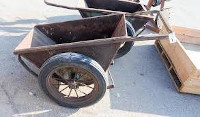|
|RoadBarrel|安全桶|||
|TrafficBarrier|交通护栏||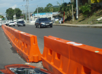|
|ScooterRider|骑电动车的人|伞,1个乘客,2个乘客||
|MotorcyleRider|骑摩托的人|伞,1个乘客,2个乘客||
|BicycleRider|骑自行车的|伞,1个乘客,2个乘客||
|Bicycle|自行车|倒在地上|
|Babycart|婴儿车|||
|LongVehicle|长尾拖车|||
|Motorcycle|||
|Scooter|电动车||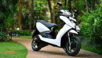|
|BicycleGroup|路边的电动车/自行车堆||
|Bus|||
|Truck|卡车||
|ConcreteTruck|水泥车|||
|Tram|电车||
|Animal|动物||
|ForkLift|叉车||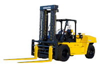|
|Trimotorcycle|电动三轮车|||
|FreightTricycle|人力三轮车||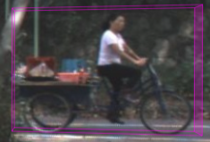|
|Crane|吊车||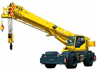|
|Excavator|挖掘机||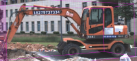|
|Roadroller|压路机||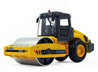|
|Bulldozer|推土机||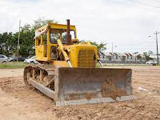|

    
  
## 3D Box要求

3d box的大小，方向，类别都需要准确标注．对于旋转方向，需要将３个轴都旋转到正确的方向．

### 车
3D box应该力求和真实目标物体大小一样，包括后视镜，车门(如果是开的)等所有附属物．box的方向是车头的方向．

对于部分遮挡的车，需要在相邻帧中找到同一物体，将box大小COPY过去．
如果找不到相同的物理，根据照片等查看是否有相同车款，如果有的话将box拷贝过去．
如果找不到，可以根据经验估计大小．

### 人
box应该包括整个人，包括四肢．人走动时形状发生变化，box应该跟着变化．
人方向为整个主题躯干的方向，或者行进的方向．

注意如果地面是倾斜的，人仍然会平行于重力方向站立，不会垂直于地面，此处有别于车．

### 雪糕筒/交通障碍栏等/防撞桶
这些物体没有明确方向，可以使用任一方向．

## 追踪ID要求

每个物体需要标注跟踪ID，在场景内唯一，如果有中断，后续应该仍然使用相同的ID.

# 如何开始标注

建议的标注方法

0. 建议按照目标物体标, 不要按帧标. 也就是一个目标物体在整个场景中全部标完后再标下一个物体.
1. 打开一个场景后，可以先浏览一下，然后开始选定目标物体进行标注．　一个场景长20s, 包含40帧原始数据，每秒选取了2帧进行标注．(我们采集的数据是每秒10帧，每帧间隔100ms. 由于间隔时间短，场景变化太小，所以不需要每帧都标注，我们可以根据每秒2帧的标注结果进行线性插值完成对剩余８帧的标注．)
2. 标一个物体时，建议选择场景中视野最好的帧开始，比如距离较近，无遮挡就满足要求，这种情况下可以比较准确的标出物体的大小和方向．　标好后，可以使用复制/粘贴的方式把box迁移到上一帧或者下一帧，两帧都调整好后，可以启动批量标注功能(edit multiple instances)，使用自动标注的方式对其他帧进行标注．　先标两帧的目的是给物体一个初始速度，对自动标注时的追踪有帮助．　也可以标完一帧后就开始批量标注，如果有问题再进行调整．
3. 批量标的时候，有时候自动标注算法会失败，比如找不到物体(追踪丢失等)，方向不正确等，这时需要手工调整，可以调整一部分后再尝试批量标．最后将不存在物体（被遮挡，或者太远看不见了）的物体box删除．自动算法包含 插值，自动（不旋转），全自动三种， 这三个功能依次更加自动化， 但是在复杂情况下出错的概率也更高。 而且这三个功能运行的条件是已经有一些或者至少一个box是已经标好的，已经标好的box越多，算法效果可能就更好。所以在标注过程中，可以先尝试全自动，如果有部分box已经标的满足要求，可以将这些box finalize（相当于已经人工确认），这样下次再运行算法时，就有更多可参考的输入。如果全自动效果不好，可以尝试自动（无旋转），如果效果仍然不好，可以尝试最简单的插值。不管用那种方法，都应该是运行算法-手工修改一两个box-运行算法-...这样交替的方式操作，整体效率最高。
4. 建议打开trajectory查看该物体在整个场景里面的轨迹，如果有异常（比如方向变化太大等）可以再次检查确认．
5. 点击finalize, save, exit, 完成一个物体在场景里面的标注．
6. 对于小目标的物体，如人，在标注的过程中可能不太容易分辩方向，可以根据其前进的方向，相对与建筑／路面的方向等进行辅助判断．　在拥挤场景如果不容易进行追踪，可以切换到10hz的数据(goto/10Hz)进行识别和标注．　10hz的数据和２Hz的数据是共享标注结果的．识别完成后建议切换回2hz,因为10HZ下帧间差距太小，标起来比较浪费时间．

# FAQ
- 如何升级版本

    标注工具是基于web页面的,服务端升级后就会自动升级,但是本地有时候会使用local cache不更新,此时可以用两种方式强制更新
    - 如果使用chrome, 可以按住ctrl按刷新按钮
    - 清除历史记录,再刷新页面
- 坐标系

    标注系统涉及到2个坐标系, 点云坐标系和世界坐标系. 在设置里面可以选择显示的坐标系(coordinate system)

    - LiDAR: 按点云坐标系显示, 原点为激光雷达的原点, 按车身方向, z轴朝上, y朝后, x朝左. 该配置下看起来世界向后走,采集车(ego car)不动

    - GPS/UTM: 按大地坐标系显示, z朝上, x朝东, y朝北. 该配置下, 看起来地面不动, 车向前后. (由于定位精度和误差, 地面有时会漂移)

- 视图转来转去一段时间后, 就很难操作, 怎么办
  - 在主界面右键选择reset view, 会回到当前frame正中间, 从上向下俯视.

- 如何确定物体的方向(旋转)
  - 对于大型的车, 一般可以使用算法确定的方向, 然后微调.
  - 对于人, 有几种方法:
    - 可以先确定位置, 最后使用行进方向作为方向. (在multiple instance edit模式下, 右键/fit/moving direction), 然后根据情况微调. 如果人没有移动, 该方法不可使用. 
    - 按照周围环境, 如路的方向, 借助图片, 确定方向, 
    - 按照人的身形确定方向.

- 如何确定遮挡物体的大小
  - 在前后帧中寻找相对完整的场景, 从该帧开始标, 然后将大小迁移到其他帧.
    - multiple instance edit模式下, interpolate/auto等功能都是保持物体大小的, 只要有已经确定大小的帧就可以工作.
    - 普通模式下, 可以使用copy, paste的方式将box从一帧挪到另一帧.
    - 在用鼠标编辑box时, 按住shift, 可以保持box大小不变.
  - 没有可参考的其他帧数据，而且被遮挡，怎么确定大小
    - 根据环境：在侧试图或者后视图中，缩放视角，查看物体周围是否有地面线，如果有将box下边缘拉到地面线的位置. 如下图，后边的灰色线为地面线，可以据此确定box的下边界。
  
    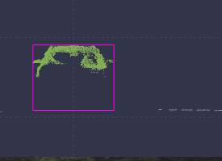

    - 根据物体的对称性，将边线拉到对称的位置
  
  - 查看对应的图片，如果是常见车型（如byd的的士），可以找到另外的同类型的车对应的box，复制粘贴，然后修改位置（不修改大小）
  - 实在没有任何办法的情况下，根据经验估计大小

- 如何修改类别
  
  如果某个object的类别标错了，又不想一个一个去修改，可以在某帧修改好之后，鼠标移到工具框的`...`然后选`Sync object type & attr`.

  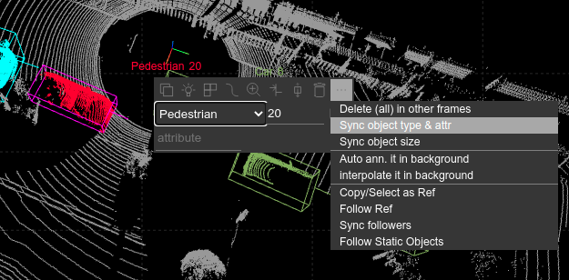

- multiple instance edit模式下, 有哪些操作方法
  - box选择, 使用鼠标可以选择多个操作对象
    - 单击: 选择/反选
    - Ctrl+单击: 选择/反选
    - shift+单击: 选择连续帧
    - 拖动: 选择多个帧
    - 鼠标右键可以选择当前帧前面的,后面的, 所有的帧
    - 注意鼠标如果在某个box的边线上点击时, 则是对box的编辑,不会进入选择功能
  - box选择后, 使用右键菜单, 可以进行如下功能
    - 删除
    - interploate 按线性移动速度方式插值
    - auto (no rotation) 自动（不旋转）
    - auto annotate 全自动
      
    - fit
      - size: 自动适配大小
      - position: 自动适配位置
      - rotation: 用ai算法调整方向
      - moving direciotn: 使用行进方向调整方向
      - 上述功能对应俯视图的4个按钮
    - finalize: 将所选box标记为人工编辑完成（后续自动算法运行时会作为重要的参考，而且自动算法不再会修改该box)
    - reload
    - goto this frame: 切换到普通模式,并切换到当前帧, 对应的box会选中
  - 右上角的按钮
    - `trajectory` 显示该物体在世界坐标系下的轨迹, 双击某个位置的box, 会退出并将对应的box选中.
    - 其他按钮跟右键菜单一样,但是针对所有的帧.
  - 显示屏有点小/大, 如果调整批量编辑的数量
    - 右上角config -> `Batch mode max box number`
    - 调整数量后, 如果显示的帧数少于场景总帧数, 请使用右上角按钮`next`/`previous`翻页
- 点云的点有点暗,看不清怎么办
  - 使用+/-调整点的大小, 或者在config菜单中修改(右上角按钮)
  
- box编辑功能
    - 快捷键列表 (俯视图/侧视图/后视图), 鼠标在某个视图上时,按键对该视图有效
       - a: 左移
       - s: 下移
       - d: 右移
       - w: 上移动
       - q: 逆时针旋转
       - e: 顺时针旋转
       - r: 逆时针旋转同时自动调整box大小
       - f: 顺时针选择同时自动调整box大小
       - g: 反向

    - 鼠标操作 (俯视图/侧视图/后视图)
      - 鼠标可以对每个试图对应的矩形边线,角,旋转方向进行拖动/双击, 产生对应编辑效果
      - 拖动 - 移动边线到鼠标位置
      - 双击 - 自动fit到最近的内点
      - shift+拖动 - 移动边线到鼠标位置,但是整个box大小保持不变
      - ctrl+拖动  - 拖动后, 从做后的位置,自动fit到物体最近的内点
    - 按钮
      - scale  - 自动调整大小
      - rotate - 自动调整方向，大小不变
      - move - 自动调整位置，大小和方向都不改变
      - I am lucky - 方向/大小/位置都自动调整
      - move direction - 使用物体的移动方向作为朝向， 
        - 如果是运动物体, 且前后帧至少有一帧已经标注过，位置正确即可计算方向
        - 如果物体没有移动或者移动很缓慢,该功能不可使用
        - 如果是大型车辆, 速度慢且转弯时, 该功能也不可使用
# 参考资料

